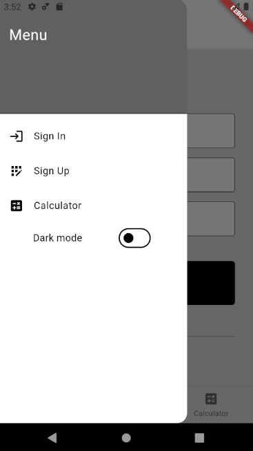
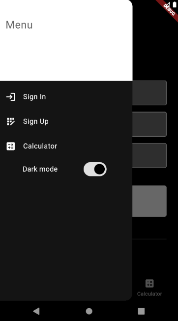
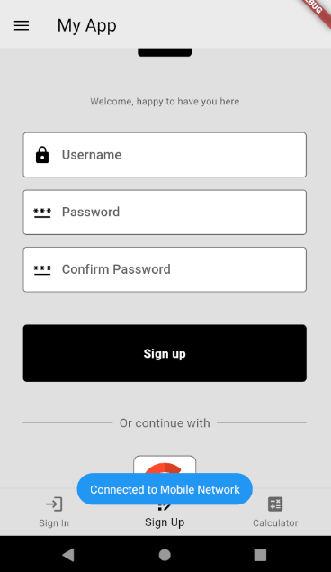
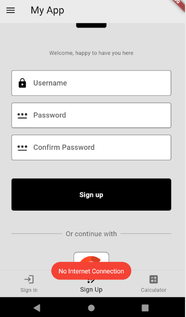
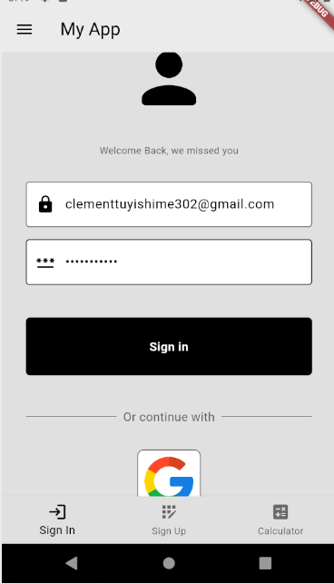
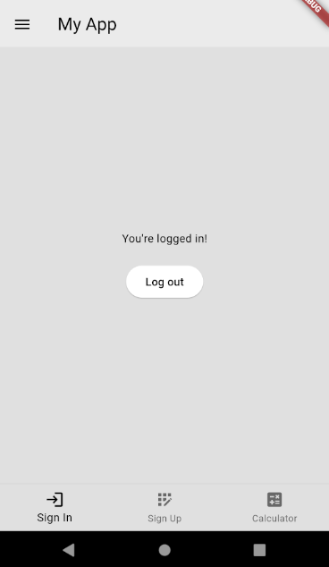

# app

A new Flutter project.

## Getting Started

This project is a starting point for a Flutter application.

A few resources to get you started if this is your first Flutter project:

- [Lab: Write your first Flutter app](https://docs.flutter.dev/get-started/codelab)
- [Cookbook: Useful Flutter samples](https://docs.flutter.dev/cookbook)

For help getting started with Flutter development, view the
[online documentation](https://docs.flutter.dev/), which offers tutorials,
samples, guidance on mobile development, and a full API reference.

# Overview of the light and dark theme

 

# Overview of the toast messages

 

# Overview of the login and dasboard pages

 

# Things done in this project

1. added a toast message to show internet connectivity
2. Used firebase to register and login user into my app
3. Used broadcast receivers to show message to user when battery percentage reaches 90%
4. Used firebase to allow user to login through Google
5. Used provider to easy change the Theme data of the app when dark mode is toggled
6. Used shared preferrences to store Theme data when the dark mode is toggle, so when app restarts, the current theme will be the same as the previous theme
